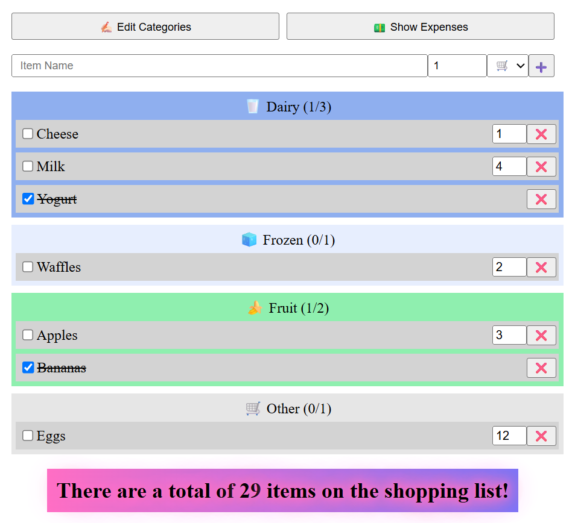
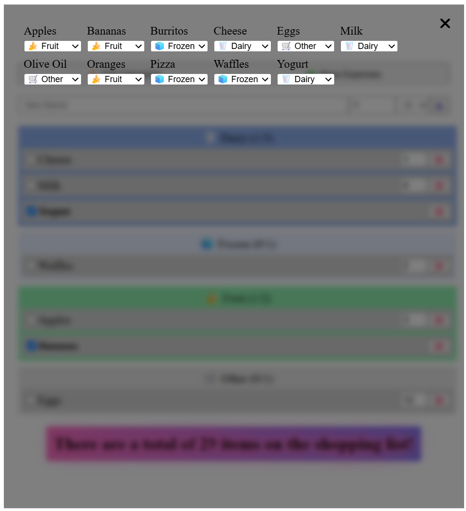
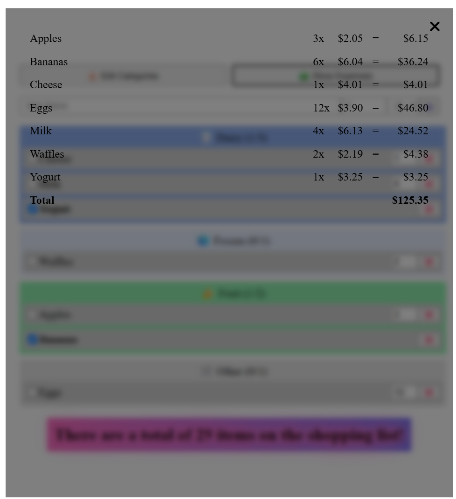

# Preact MVC Shopping Cart

A modern shopping cart web application built with Preact, TypeScript, and following the MVC (Model-View-Controller) architectural pattern. This project demonstrates clean architecture, state management, and component-based development using Preact.

## Features

- 🛒 Shopping cart functionality
- 📦 Product listing and management
- 💰 Price calculation and cart totals
- 🎨 Modern and responsive UI
- 🔄 Real-time state updates using Preact Signals
- 📱 Mobile-friendly design

## Tech Stack

- [Preact](https://preactjs.com/) - Fast 3kB alternative to React
- [TypeScript](https://www.typescriptlang.org/) - Type-safe JavaScript
- [Vite](https://vitejs.dev/) - Next Generation Frontend Tooling
- [Preact Signals](https://preactjs.com/guide/v10/signals/) - State management

## Demo








## Project Structure

```
src/
├── components/     # Reusable UI components
├── main.tsx       # Application entry point
├── state.ts       # State management and business logic
└── index.css      # Global styles
```

## Getting Started

### Prerequisites

- Node.js (v16 or higher)
- npm or yarn

### Installation

1. Clone the repository:
   ```bash
   git clone <repository-url>
   cd preact-mvc-shopping-cart
   ```

2. Install dependencies:
   ```bash
   npm install
   # or
   yarn install
   ```

### Development

To start the development server:

```bash
npm run dev
# or
yarn dev
```

The application will be available at `http://localhost:5173`

### Building for Production

To create a production build:

```bash
npm run build
# or
yarn build
```

The build artifacts will be stored in the `dist/` directory.

### Preview Production Build

To preview the production build locally:

```bash
npm run preview
# or
yarn preview
```

## Architecture

This project follows the MVC pattern:

- **Model**: State management and business logic in `state.ts`
- **View**: UI components in the `components/` directory
- **Controller**: Logic that connects the Model and View

## Contributing

1. Fork the repository
2. Create your feature branch (`git checkout -b feature/amazing-feature`)
3. Commit your changes (`git commit -m 'Add some amazing feature'`)
4. Push to the branch (`git push origin feature/amazing-feature`)
5. Open a Pull Request


